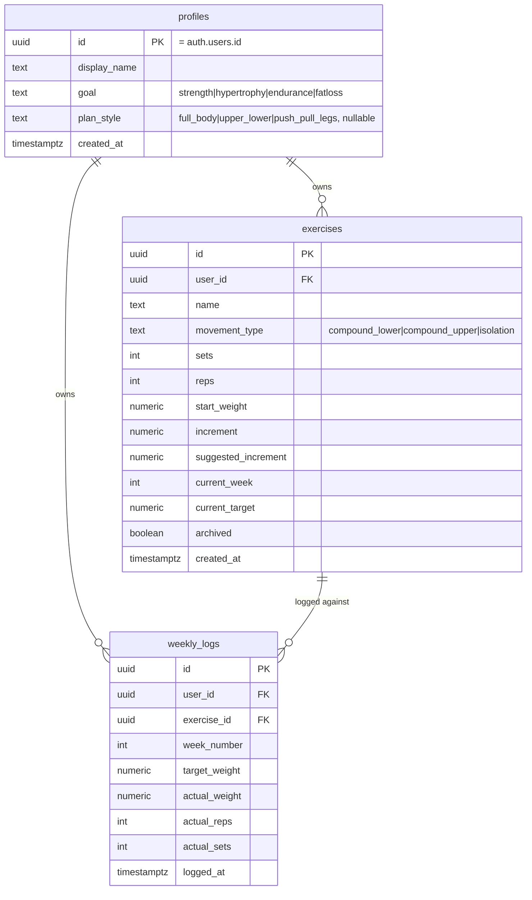
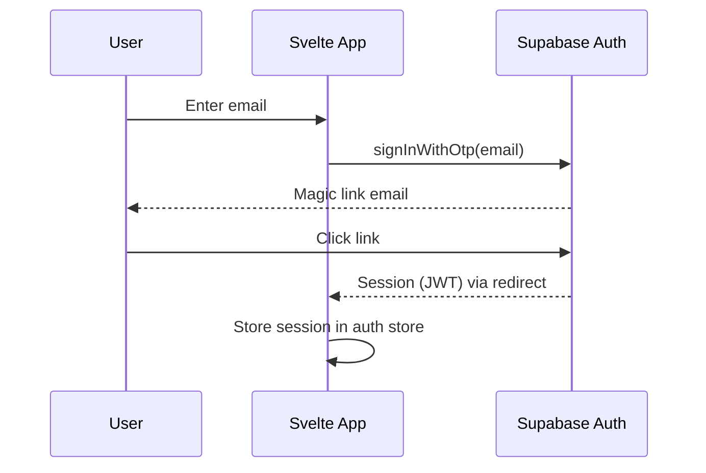
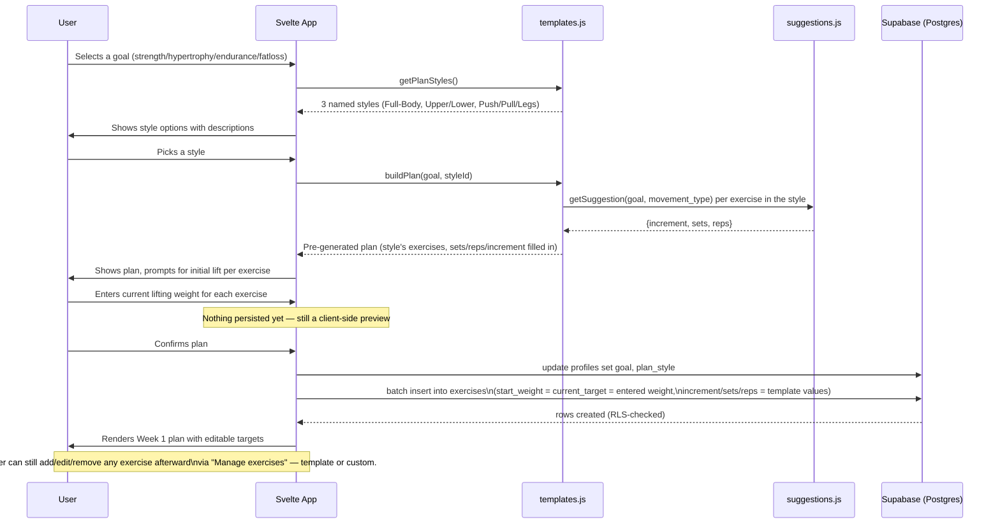
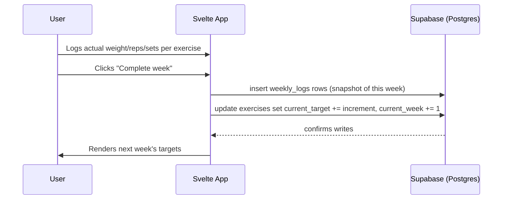
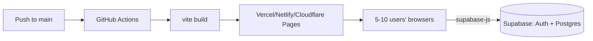

# LiftLog — Architecture

## 1. High-level architecture

```mermaid
flowchart LR
    subgraph Client["Browser (Vite + Svelte + Tailwind, static build)"]
        UI[Svelte UI components]
        Store[Svelte stores\n(auth, exercises, history)]
        SupaClient[supabase-js client]
    end

    subgraph Hosting["Static hosting (Vercel / Netlify / Cloudflare Pages)"]
        CDN[Static assets served from CDN]
    end

    subgraph Supabase["Supabase project"]
        Auth[Supabase Auth]
        DB[(Postgres\nRow-Level Security)]
        Realtime[Realtime channel (optional)]
    end

    UI --> Store --> SupaClient
    SupaClient -- HTTPS / REST+WS --> Auth
    SupaClient -- HTTPS / REST+WS --> DB
    SupaClient -. subscribe .-> Realtime
    CDN --> Client
```

There is no custom backend server. The Svelte app is a static bundle served
from a CDN; all dynamic behavior (auth, reads, writes) happens directly from
the browser to Supabase, governed entirely by Postgres Row-Level Security
(RLS) policies. This keeps the whole system to two moving parts: a static
frontend and a managed Postgres+Auth service.

## 2. Components

| Component | Responsibility |
|---|---|
| **Svelte app** | Renders UI, holds ephemeral view state, calls Supabase client. |
| **Svelte stores** | Thin reactive wrappers around Supabase queries/subscriptions (auth session, exercises list, current plan, history). |
| **`suggestions.js`** | Pure function: `(goal, exerciseType) -> {increment, sets, reps}`. No I/O — fully unit-testable. |
| **Supabase Auth** | Email/magic-link sign-in; issues a JWT the client attaches to every request. |
| **Postgres (Supabase)** | Source of truth. RLS policies enforce that a user only ever reads/writes their own rows. |
| **Static host** | Serves the built assets; no server-side rendering needed. |

## 3. Data model

### 3.1 Plan templates (code, not database)

Templates are **static data shipped in the frontend bundle**, not rows in
Postgres — the exercise selection for a given (goal, style) pair is the same
for every user and never changes per-user, so there's nothing to query or
secure. They exist purely to pre-populate the onboarding form.

A **plan style** is an exercise selection (which lifts, how many). A **goal**
determines the numbers (sets/reps/increment) via the existing
`getSuggestion(goal, movement_type)` table. Combining a style with a goal is
what produces the pre-generated plan — so 3 styles × 4 goals gives 12
distinct starter plans without duplicating exercise lists per goal.

```js
// src/lib/templates.js
import { getSuggestion } from './suggestions.js';

export const PLAN_STYLES = [
  {
    id: 'full_body',
    name: 'Full-Body',
    description: '3x/week, hits everything each session. Best for beginners or limited time.',
    exercises: [
      { name: 'Back Squat',        movement_type: 'compound_lower' },
      { name: 'Bench Press',       movement_type: 'compound_upper' },
      { name: 'Barbell Row',       movement_type: 'compound_upper' },
      { name: 'Romanian Deadlift', movement_type: 'compound_lower' },
      { name: 'Overhead Press',    movement_type: 'compound_upper' },
    ],
  },
  {
    id: 'upper_lower',
    name: 'Upper / Lower',
    description: '4x/week split, more volume per muscle group than full-body.',
    exercises: [
      { name: 'Bench Press',        movement_type: 'compound_upper' },
      { name: 'Overhead Press',     movement_type: 'compound_upper' },
      { name: 'Barbell Row',        movement_type: 'compound_upper' },
      { name: 'Lat Pulldown',       movement_type: 'compound_upper' },
      { name: 'Back Squat',         movement_type: 'compound_lower' },
      { name: 'Romanian Deadlift',  movement_type: 'compound_lower' },
      { name: 'Leg Press',          movement_type: 'compound_lower' },
    ],
  },
  {
    id: 'push_pull_legs',
    name: 'Push / Pull / Legs',
    description: '6x/week, highest volume — for intermediate/advanced lifters.',
    exercises: [
      { name: 'Bench Press',       movement_type: 'compound_upper' },
      { name: 'Overhead Press',    movement_type: 'compound_upper' },
      { name: 'Triceps Pressdown', movement_type: 'isolation' },
      { name: 'Barbell Row',       movement_type: 'compound_upper' },
      { name: 'Lat Pulldown',      movement_type: 'compound_upper' },
      { name: 'Bicep Curl',        movement_type: 'isolation' },
      { name: 'Back Squat',        movement_type: 'compound_lower' },
      { name: 'Romanian Deadlift', movement_type: 'compound_lower' },
      { name: 'Leg Curl',          movement_type: 'isolation' },
    ],
  },
];

export function getPlanStyles() {
  // What the UI lists for the user to pick from, for any goal (same 3 styles
  // apply to every goal — only the numbers differ once a goal is applied).
  return PLAN_STYLES.map(({ id, name, description }) => ({ id, name, description }));
}

export function buildPlan(goal, styleId) {
  const style = PLAN_STYLES.find(s => s.id === styleId) || PLAN_STYLES[0];
  return style.exercises.map(ex => ({
    ...ex,
    ...getSuggestion(goal, ex.movement_type), // { increment, sets, reps }
  }));
}
```

`getPlanStyles()` powers "Step 1.5 — Choose a plan style" in `PLAN.md`: the
user sees at least 3 named options (with a one-line description each) for
whatever goal they picked. `buildPlan(goal, styleId)` then powers "Step 2 —
Pre-generated plan": the instant a style is picked, this renders a full
starter plan with sets/reps/suggested increment already filled in — no
database round trip. Nothing is written to `exercises` until the user
enters a starting weight per exercise (Step 3) and submits; at that point
the client **batch-inserts** one row per template exercise, using the
template's sets/reps/increment as the row's initial values (still editable
afterward, same as any manually-added exercise).

Adding a 4th style, or a 4th goal, is purely additive — append to
`PLAN_STYLES` or to the `SUGGESTIONS` table in `suggestions.js` — no schema
migration needed, since none of this is stored in the database.

### 3.2 Database schema



Full migration SQL (`supabase/migrations/0001_init.sql`):

```sql
create table profiles (
  id uuid primary key references auth.users(id) on delete cascade,
  display_name text,
  goal text not null default 'hypertrophy'
    check (goal in ('strength','hypertrophy','endurance','fatloss')),
  plan_style text
    check (plan_style in ('full_body','upper_lower','push_pull_legs')),
  created_at timestamptz not null default now()
);

create table exercises (
  id uuid primary key default gen_random_uuid(),
  user_id uuid not null references profiles(id) on delete cascade,
  name text not null,
  movement_type text not null
    check (movement_type in ('compound_lower','compound_upper','isolation')),
  sets int not null default 3,
  reps int not null default 8,
  start_weight numeric not null,
  increment numeric not null,
  suggested_increment numeric not null,
  current_week int not null default 1,
  current_target numeric not null,
  archived boolean not null default false,
  created_at timestamptz not null default now()
);

create table weekly_logs (
  id uuid primary key default gen_random_uuid(),
  user_id uuid not null references profiles(id) on delete cascade,
  exercise_id uuid not null references exercises(id) on delete cascade,
  week_number int not null,
  target_weight numeric not null,
  actual_weight numeric,
  actual_reps int,
  actual_sets int,
  logged_at timestamptz not null default now()
);
```

## 4. Row-Level Security (authorization)

RLS is the entire authorization layer — there is no separate API server to
enforce access control, so every table must have policies before it's
usable.

```sql
alter table profiles enable row level security;
alter table exercises enable row level security;
alter table weekly_logs enable row level security;

-- Each user may only see/change their own row(s)
create policy "own profile" on profiles
  for all using (auth.uid() = id) with check (auth.uid() = id);

create policy "own exercises" on exercises
  for all using (auth.uid() = user_id) with check (auth.uid() = user_id);

create policy "own logs" on weekly_logs
  for all using (auth.uid() = user_id) with check (auth.uid() = user_id);
```

This is what makes "5–10 users, fully private from each other" true by
construction: even if the client code had a bug, Postgres itself refuses
cross-user reads/writes.

## 5. Core flows

### 5.1 Sign-in


### 5.2 Onboarding: goal → plan style → pre-generated plan → initial lifts → targets


### 5.3 Complete a week


## 6. Progression-suggestion logic

Pure, stateless, and unit-tested independent of the UI or database:

```js
// src/lib/suggestions.js
export const SUGGESTIONS = {
  strength:    { compound_lower: {increment: 2.5,  sets: 4, reps: 5},
                 compound_upper: {increment: 1.25, sets: 4, reps: 5},
                 isolation:      {increment: 0.5,  sets: 3, reps: 6} },
  hypertrophy: { compound_lower: {increment: 1.25, sets: 4, reps: 10},
                 compound_upper: {increment: 0.5,  sets: 3, reps: 10},
                 isolation:      {increment: 0.25, sets: 3, reps: 12} },
  endurance:   { compound_lower: {increment: 0.5,  sets: 3, reps: 15},
                 compound_upper: {increment: 0.25, sets: 3, reps: 15},
                 isolation:      {increment: 0.25, sets: 2, reps: 18} },
  fatloss:     { compound_lower: {increment: 0.5,  sets: 3, reps: 12},
                 compound_upper: {increment: 0.25, sets: 3, reps: 12},
                 isolation:      {increment: 0.25, sets: 3, reps: 15} },
};

export function getSuggestion(goal, type) {
  const g = SUGGESTIONS[goal] ? goal : 'hypertrophy';
  const t = SUGGESTIONS[g][type] ? type : 'compound_lower';
  return SUGGESTIONS[g][t];
}
```

The value returned is always a **default**, never enforced — every field it
fills is a normal editable input in the exercise form and can be changed at
creation time or later (stored per-exercise as `increment`, independent of
`suggested_increment`, so the UI can offer a "reset to suggested" action).

## 7. Frontend state management

Svelte's built-in stores are sufficient at this scale — no Redux/Zustand
needed:

- `stores/auth.js` — wraps `supabase.auth.onAuthStateChange`, exposes the
  current session as a readable store.
- `stores/exercises.js` — subscribes to the current user's `exercises` rows
  (Supabase Realtime or a manual refetch after writes), exposes a readable
  store the UI renders from.
- `stores/history.js` — paginated read of `weekly_logs`, grouped by week for
  the history view.

Writes go: **component event → store action → supabase-js call → Postgres**;
reads flow back through the same store via subscription or refetch, so the
UI is always rendered from one source of truth per domain.

## 8. Offline tolerance

At this scale, a lightweight approach is enough:
- Queue writes in memory (or `localStorage` as a durability backstop) if a
  write fails due to network loss.
- Retry on `window.online` event.
- Show a small "unsynced changes" indicator so the user knows a log hasn't
  saved yet — avoids silent data loss mid-workout with spotty gym wifi.

Full offline-first (service worker + IndexedDB sync) is listed as a Phase 2/
future enhancement in `PLAN.md`, not required for v1.

## 9. Security considerations

- All authorization is enforced by Postgres RLS (§4) — the anon key shipped
  to the client is safe to expose because it can do nothing outside what
  RLS allows.
- No secret service-role key is ever used client-side.
- Magic-link auth avoids password storage/reset complexity entirely for a
  small trusted user base.
- Invite-only: user accounts are created manually or via a private
  invite link, not public self-serve sign-up, since this is meant for a
  known group of 5–10 people.

## 10. Scale & cost notes

At 5–10 users logging a few sessions a week:
- Database size: a few MB even after years of logs — nowhere near the
  500 MB free-tier Postgres cap.
- Bandwidth/API calls: trivially within free-tier limits on any of the
  hosting/Supabase free tiers.
- The only operational quirk at this scale is Supabase's free-tier project
  auto-pausing after 7 days idle — restore-from-dashboard is a one-click
  fix, or a scheduled GitHub Actions ping keeps it warm if that's
  undesirable (see `PLAN.md` §11).

This architecture scales well past 10 users without changes (RLS-based
multi-tenancy is the same pattern used at much larger scale); it was chosen
for simplicity at this size, not because it caps out here.

## 11. Deployment architecture



CI/CD is a single job: install, build, deploy static assets. Supabase schema
changes are applied via `supabase db push` (or pasted into the SQL editor)
using the migration files checked into `supabase/migrations/`, so the
database schema is versioned alongside the code.
